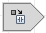

.. Icons and logos.

.. Logos

.. |l-pads| image:: _static/img/l-pads.png
.. |l-padsmaker| image:: _static/img/l-padsmaker.png

.. Common icons
.. |i-pads-layout| image:: _static/img/i-pads-layout.png
.. |i-pads-router| image:: _static/img/i-pads-router.png

.. Schematics icons

.. |is-array| image:: _static/img/is-array.png

.. |is-block| image:: _static/img/is-block.png
.. |is-bus| image:: _static/img/is-bus.png
.. |is-filter| image:: _static/img/is-filter.png
.. |is-flip| image:: _static/img/is-flip.png
.. |is-handle| image:: _static/img/is-handle.png

.. |is-net| image:: _static/img/is-net.png

.. PCB icons

.. |il-copper-pour-cutout| image:: _static/img/il-copper-pour-cutout.png
.. |il-copper-pour| image:: _static/img/il-copper-pour.png
.. |il-drafting| image:: _static/img/il-drafting.png
.. |il-keepout| image:: _static/img/il-keepout.png
.. |il-outline| image:: _static/img/il-outline.png
.. |il-plane-shape-cutout| image:: _static/img/il-plane-shape-cutout.png
.. |il-plane-shape| image:: _static/img/il-plane-shape.png
.. |il-solid-copper-cutout| image:: _static/img/il-solid-copper-cutout.png
.. |il-solid-copper| image:: _static/img/il-solid-copper.png
